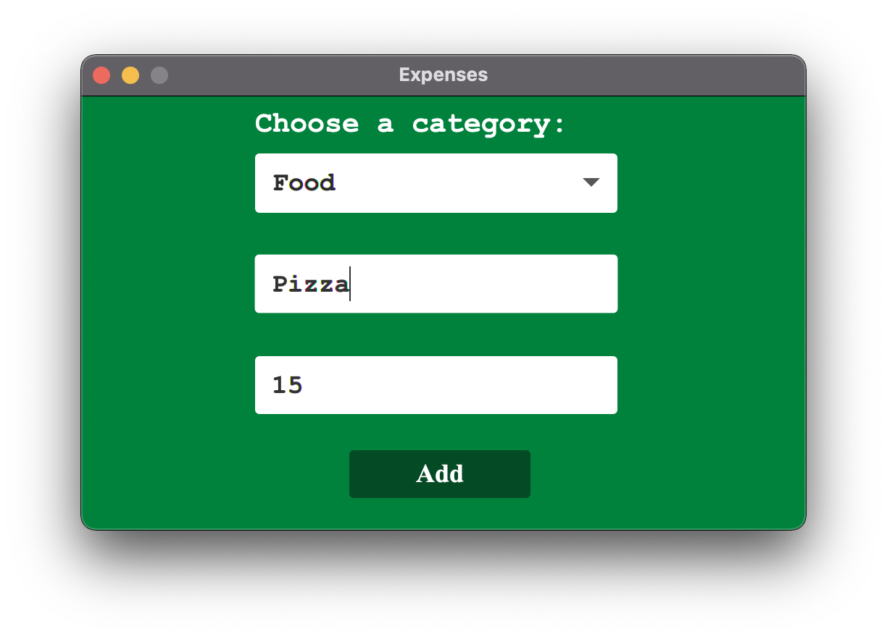
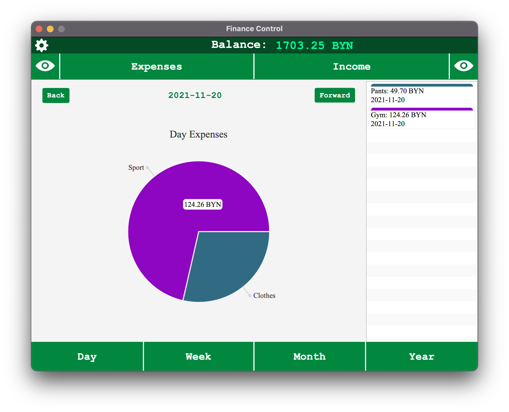
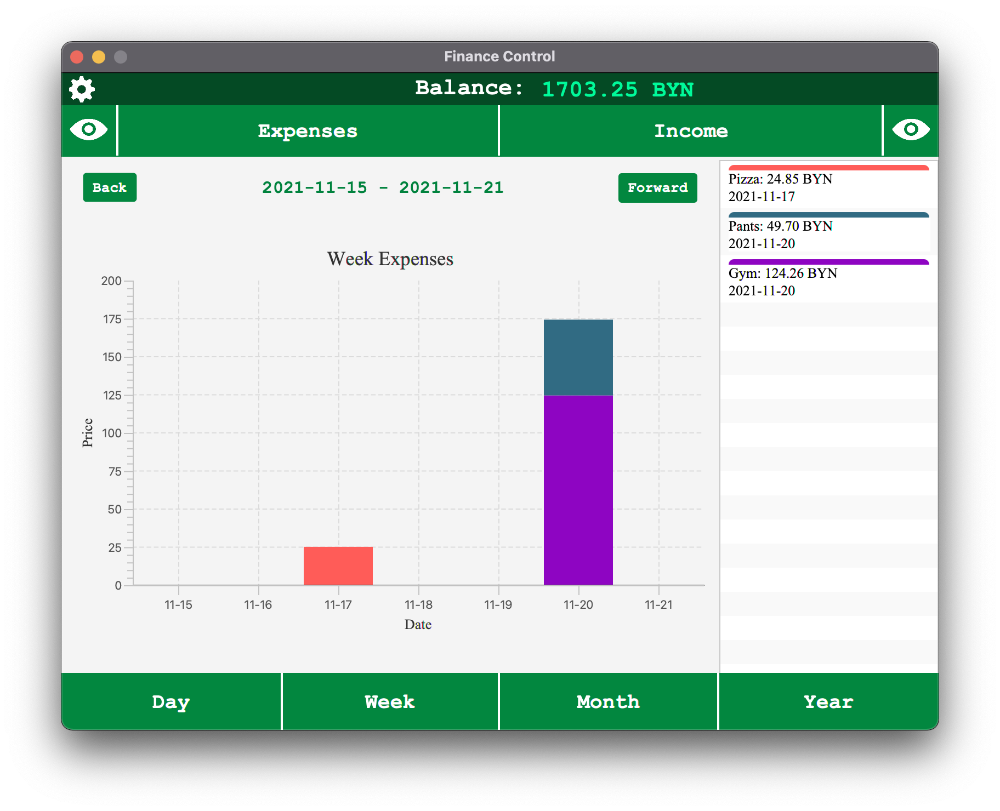
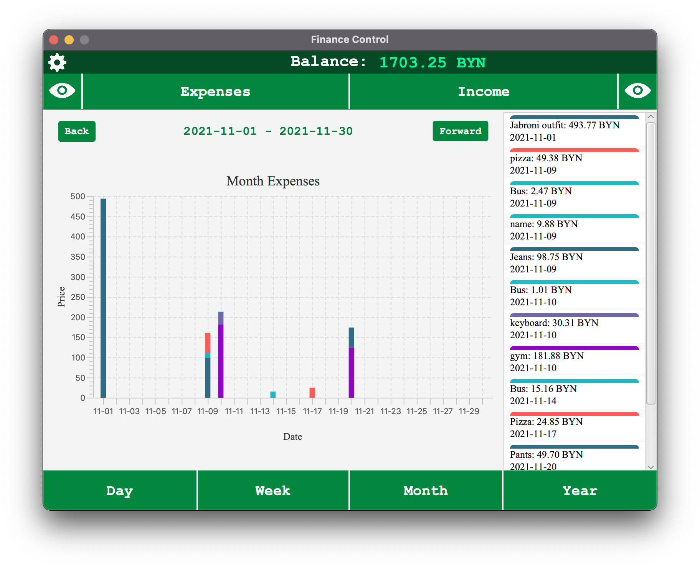
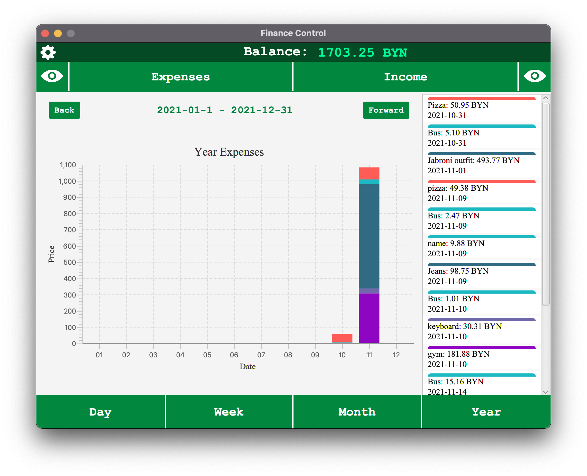
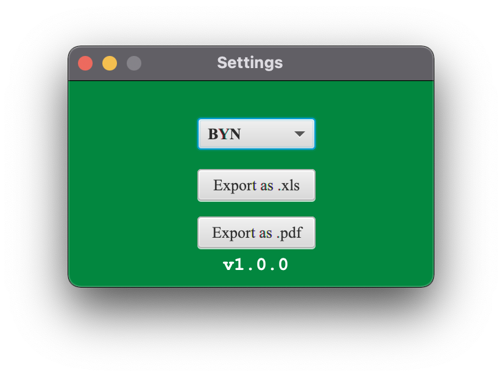

# FinanceControl

The Finance Controll App is created to help you manage your money. 

## You can add Expenses and Income

***Data is stored in the SQLite database.***

## Different types of charts to visualize and analyze data.
- Day Chart

- Week Chart

- Month Chart

- Year Chart

## Option to set currency in settings
Available currencies:
- USD (United States Dollar)
- EUR (Euro)
- RUB (Russian Ruble)
- BYN (Belarusian Ruble)

Currences' rates are taken from [National Bank of Republic of Belarus](https://www.nbrb.by/) API

## Option to export data
Now you can export your operations into:
- XLS
- PDF

### Application settings

## Application files are stored in
- %AppData%/Local/FinanceControl on <i>Windows</i>
- %HOME/Documents/FinanceControl on <i>Mac</i>
- Not tested on <i>Linux</i> yet

## Installation
1. Download the latest release
2. Install the [latest Java version](https://adoptium.net/?variant=openjdk17&jvmVariant=hotspot) *(App works properly on Java 17)*
3. Starting application
    - Extract the archive and open *start* file **(macOS)**
    - Extract the archive and open *start.vbs* file **(Windows)**
4. There you go!